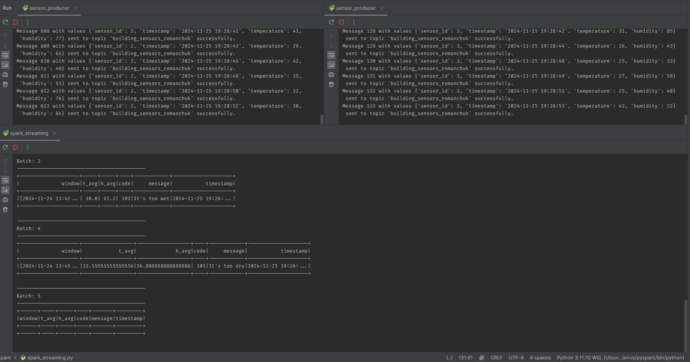

# Kafka-Based Sensor Data Processing and Alerts

This project involves a Kafka-based streaming pipeline to process temperature and humidity data generated by sensors. The system calculates the average temperature and humidity over a specified time window and triggers alerts if the values exceed predefined boundaries.

## Components

### 1. **`configs.py`**: Kafka Configuration File
This file contains all the Kafka configuration details.

### 2. **`sensor_producer.py`**: Sensor Data Producer
This script simulates sensors generating temperature and humidity data. The data is sent to the Kafka topic:
- **Topic reading**: `building_sensors_{name}`
- **Topic sending**: `avg_alerts_{name}`
- **Data Example**:


| Key                                   | Value                                                                                                                                                                                                                                          |
|---------------------------------------|------------------------------------------------------------------------------------------------------------------------------------------------------------------------------------------------------------------------------------------------|
| 01add1ae-2d47-4b45-b0ad-1414c9672404 | {"window":{"start":"2024-11-24T13:45:30.000+01:00","end":"2024-11-24T13:46:30.000+01:00"},"t_avg":33.55555555555556,"h_avg":36.888888888888886,"code":"101","message":"It's too dry","timestamp":"2024-11-25 20:27:25.369466"} |


## Result


```plaintext
2024-11-25 20:26:47,664 - Starting the Kafka streaming application.
2024-11-25 20:27:26,052 - Callback Server Starting
2024-11-25 20:27:26,053 - Socket listening on ('127.0.0.1', 39825)
2024-11-25 20:28:04,610 - Python Server ready to receive messages
2024-11-25 20:28:04,611 - Received command c on object id p0
2024-11-25 20:28:04,620 - Processing Batch ID: 0
2024-11-25 20:29:59,518 - Batch Data:
Empty DataFrame
Columns: [key, value]
Index: []
2024-11-25 20:30:29,905 - Received command c on object id p0
2024-11-25 20:30:29,909 - Processing Batch ID: 1
2024-11-25 20:31:31,442 - Batch Data:
                                 key                                                                                                                                                                                                 value
cbc9b3a7-ab3c-408e-bda1-7b52e6911ad4 {"window":{"start":"2024-11-24T13:29:00.000+01:00","end":"2024-11-24T13:30:00.000+01:00"},"t_avg":34.875,"h_avg":62.5,"code":"102","message":"It's too wet","timestamp":"2024-11-25 20:27:25.369466"}
2024-11-25 20:32:13,644 - Received command c on object id p0
2024-11-25 20:32:13,648 - Processing Batch ID: 2
2024-11-25 20:33:09,659 - Batch Data:
Empty DataFrame
Columns: [key, value]
Index: []
2024-11-25 20:33:39,468 - Received command c on object id p0
2024-11-25 20:33:39,475 - Processing Batch ID: 3
2024-11-25 20:34:32,706 - Batch Data:
                                 key                                                                                                                                                                                               value
5a58f881-0f98-4b1d-adc3-cbd9f260f512 {"window":{"start":"2024-11-24T13:42:30.000+01:00","end":"2024-11-24T13:43:30.000+01:00"},"t_avg":38.0,"h_avg":61.2,"code":"102","message":"It's too wet","timestamp":"2024-11-25 20:27:25.369466"}
2024-11-25 20:35:03,148 - Received command c on object id p0
2024-11-25 20:35:03,154 - Processing Batch ID: 4
2024-11-25 20:36:02,635 - Batch Data:
                                 key                                                                                                                                                                                                                          value
01add1ae-2d47-4b45-b0ad-1414c9672404 {"window":{"start":"2024-11-24T13:45:30.000+01:00","end":"2024-11-24T13:46:30.000+01:00"},"t_avg":33.55555555555556,"h_avg":36.888888888888886,"code":"101","message":"It's too dry","timestamp":"2024-11-25 20:27:25.369466"}
2024-11-25 20:36:31,482 - Received command c on object id p0
2024-11-25 20:36:31,495 - Processing Batch ID: 5
2024-11-25 20:37:27,305 - Batch Data:
Empty DataFrame
Columns: [key, value]
Index: []
2024-11-25 20:38:01,867 - Received command c on object id p0
2024-11-25 20:38:01,876 - Processing Batch ID: 6
2024-11-25 20:39:09,491 - Batch Data:
Empty DataFrame
Columns: [key, value]
Index: []
2024-11-25 20:39:43,016 - Received command c on object id p0
2024-11-25 20:39:43,022 - Processing Batch ID: 7
2024-11-25 20:40:42,034 - Batch Data:
Empty DataFrame
Columns: [key, value]
Index: []
2024-11-25 20:41:13,830 - Received command c on object id p0
2024-11-25 20:41:13,833 - Processing Batch ID: 8
2024-11-25 20:42:14,989 - Batch Data:
Empty DataFrame
Columns: [key, value]
Index: []
2024-11-25 20:42:46,786 - Received command c on object id p0
2024-11-25 20:42:46,799 - Processing Batch ID: 9
2024-11-25 20:43:48,384 - Batch Data:
Empty DataFrame
Columns: [key, value]
Index: []
2024-11-25 20:44:20,973 - Received command c on object id p0
2024-11-25 20:44:20,978 - Processing Batch ID: 10
2024-11-25 20:45:25,168 - Batch Data:
Empty DataFrame
Columns: [key, value]
Index: []
2024-11-25 20:46:01,323 - Received command c on object id p0
2024-11-25 20:46:01,330 - Processing Batch ID: 11
2024-11-25 20:47:07,345 - Batch Data:
Empty DataFrame
Columns: [key, value]
Index: []
2024-11-25 20:47:44,647 - Received command c on object id p0
2024-11-25 20:47:44,656 - Processing Batch ID: 12
2024-11-25 20:48:50,269 - Batch Data:
Empty DataFrame
Columns: [key, value]
Index: []
2024-11-25 20:49:28,292 - Received command c on object id p0
2024-11-25 20:49:28,300 - Processing Batch ID: 13
2024-11-25 20:50:34,702 - Batch Data:
Empty DataFrame
Columns: [key, value]
Index: []
2024-11-25 20:51:09,002 - Received command c on object id p0
2024-11-25 20:51:09,011 - Processing Batch ID: 14
```
